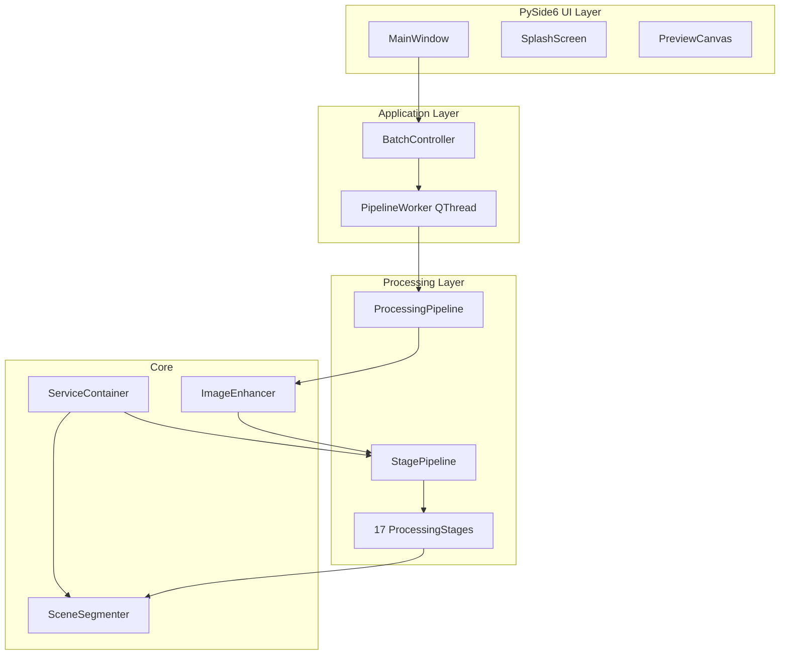

# Photo Enhancer Pro

**Commercial-grade native Windows desktop application for automatic photo enhancement in iPhone Pro style.**


---

## Overview

Photo Enhancer Pro is a **native desktop application** — not a web app, not localhost, not a Python demo. Double-click `Photo Enhancer Pro.exe` and start enhancing photos instantly.

Comparable quality target: natural iPhone 15/16 Pro processing — no HDR look, no AI artifacts, no fake colors.

---

## Features

| Feature | Description |
|---------|-------------|
| **Native Qt UI** | PySide6 dark theme, splash screen, dockable panels |
| **Drag & Drop** | Folders, ZIP, single/multiple images |
| **Before/After** | Compare slider, zoom, pan |
| **17-Stage Pipeline** | Modular `ProcessingStage` architecture |
| **7 Presets** | iPhone Pro, DSLR, Landscape, Portrait, Nature, Instagram, Cinematic |
| **Batch Processing** | Multithreaded — thousands of photos |
| **EXIF Preservation** | Orientation, metadata kept |
| **Quality Tools** | Duplicate detection, blur detection, ranking |
| **Offline** | 100% local processing |

---

## Architecture



---

## Installation

### From source

```bash
git clone https://github.com/kookoosya/Photo-Enhancer-Pro.git
cd Photo-Enhancer-Pro
python -m venv venv
venv\Scripts\activate
pip install -r requirements.txt
python main.py
```

### Windows executable

```powershell
.\build\build_windows.ps1
```

Output:
- `dist\Photo Enhancer Pro.exe` — portable executable
- `installer\output\Photo Enhancer Pro Setup.exe` — installer (requires Inno Setup)

---

## Usage

1. Launch `Photo Enhancer Pro.exe`
2. Drag a folder or ZIP onto the window, or use **File → Open Folder**
3. Select preset (iPhone Pro default)
4. Click **Start Processing**
5. View before/after in the preview panel
6. Open output folder or ZIP when done

### CLI (headless)

```bash
python main.py --cli "C:\Photos\Vacation" -p iphone_pro -o "C:\Output"
```

---

## Pipeline Stages

Configurable in `config.json` → `pipeline_stages`:

1. Segmentation
2. Lens correction
3. White balance
4. Exposure
5. Highlight recovery
6. Shadow recovery
7. Tone mapping
8. Local contrast
9. Micro contrast
10. Texture
11. Dehaze
12. Color balance
13. Regional enhance (sky/grass/water)
14. Noise reduction
15. Sharpening
16. Final optimization
17. Safety blend

---

## Project Structure

```
photo-enhancer-pro/
├── main.py                 # Entry point
├── ui/                     # PySide6 desktop UI
│   ├── app.py              # QApplication bootstrap
│   ├── main_window.py      # Main window
│   ├── splash.py           # Splash screen
│   ├── styles/dark.qss     # Dark theme
│   └── widgets/            # Preview, histogram, spinner
├── app/                    # Application layer
│   ├── controller.py       # BatchController
│   └── workers/            # QThread workers
├── processing/             # Stage pipeline
│   ├── stages/             # Independent ProcessingStages
│   └── stage_pipeline.py
├── core/                   # DI container
├── enhancer.py             # ImageEnhancer facade
├── pipeline.py             # Batch orchestration
├── segmentation/           # Scene detection
├── styles/                 # Presets
├── utils/                  # I/O, EXIF, quality
├── build/                  # Build scripts
├── installer/              # Inno Setup
├── tests/                  # 23 tests
└── PhotoEnhancerPro.spec   # PyInstaller
```

---

## Roadmap

- [x] Native PySide6 desktop UI
- [x] Modular ProcessingStage pipeline
- [x] Multithreaded batch processing
- [x] PyInstaller Windows build
- [x] Inno Setup installer
- [ ] SAM2 segmentation integration
- [ ] Real-ESRGAN native upscaling
- [ ] macOS .app bundle
- [ ] Linux AppImage

---

## License

MIT — see [LICENSE](LICENSE)
